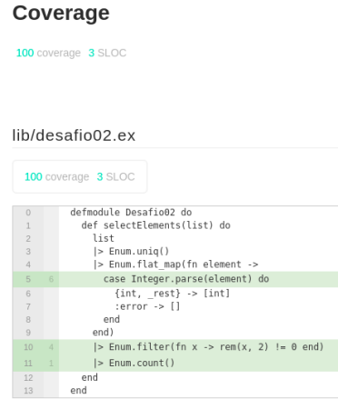

# Chapter 01 - Fundamentos do Elixir (Desafio 02)

1. Nesse desafio, você deverá criar um novo projeto com uma função que, dada uma lista de strings que representem números ou não (exemplo `["1", "3", "6", "43", "banana", "6", "abc"]`), filtre todos os elementos numéricos da lista e retorne quantos números ímpares existem nessa lista.

Diferente do desafio 01, a sua solução para esse desafio não precisa ser recursiva. Sinta-se livre para criar a solução da melhor maneira que achar (veja a [dica sobre o módulo Enum](https://www.notion.so/Desafio-02-Filtragem-em-listas-87cf8190c3594fe59b2486c5b7df180c)) 🚀


## Passos Adicionais
1. Utilização da biblioteca [excoveralls](https://github.com/parroty/excoveralls) para monitoração dos testes da aplicação.

```
mix coveralls.html
```
2. Testes de Unidade para toda a aplicação.



## Conteúdo Desenvolvido nos Cursos


